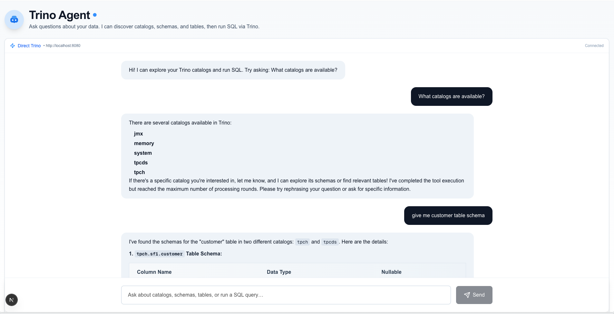
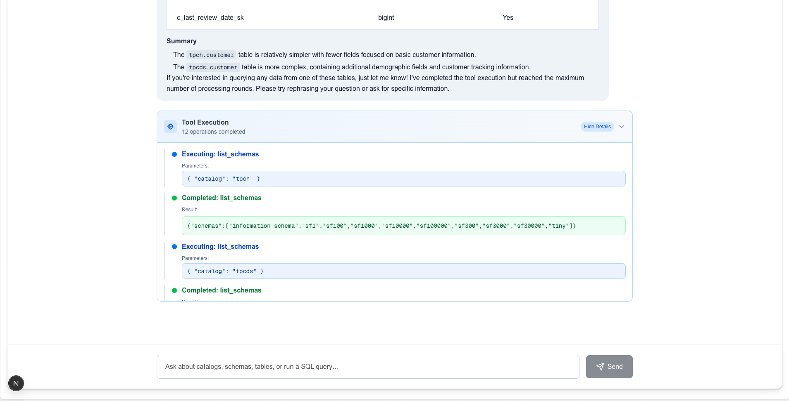

# Trino Agent

A Next.js application that provides a conversational interface to Trino databases using OpenAI's GPT models and tool calling. Ask questions in natural language and get SQL results from your Trino data sources.




## Features

- 🤖 **Natural Language Queries**: Ask questions about your data in plain English
- 🔧 **Direct Trino Connection**: Connect directly to your Trino cluster
- 📊 **Rich Data Operations**: List catalogs, schemas, tables, inspect schemas, and execute queries
- 💬 **Streaming Chat Interface**: Real-time responses with tool execution visibility
-  **Production Ready**: Proper error handling and connection management

## Tech Stack

- **Frontend**: Next.js 15 (App Router), TypeScript, Tailwind CSS
- **AI**: OpenAI GPT-4 with function calling
- **Database**: Trino (direct connection)
- **Real-time**: Server-sent events (SSE) for streaming responses

## Quick Start

### Prerequisites

- Node.js 18+
- OpenAI API key
- Trino server (Docker or existing instance)

### 1. Clone and Install

```bash
git clone <your-repo-url>
cd trino-agent
npm install
```

### 2. Start Trino (Docker)

```bash
docker run -d --name trino -p 8080:8080 trinodb/trino:latest
```

### 3. Configure Environment

Create `.env.local`:

```bash
# Required: OpenAI API Key
OPENAI_API_KEY=your_openai_api_key_here

# Optional: Trino Configuration (defaults shown)
TRINO_HOST=localhost
TRINO_PORT=8080
TRINO_USER=trino
TRINO_SCHEME=http
```

### 4. Run the Application

```bash
npm run dev
```

Open [http://localhost:3000](http://localhost:3000) and start asking questions about your data!

## Example Queries

- "What catalogs are available?"
- "Show me tables in the tpch.tiny schema"
- "Describe the customer table structure"
- "Show me the first 10 customers"
- "What's the average account balance by market segment?"
- "Find the top 5 customers by total order value"

## Connection

The application connects directly to Trino using the host, port, user, and scheme defined in your environment variables. On startup, it pings the Trino health endpoint to show connection status in the UI.

## Development

### Project Structure

```
src/
├── app/
│   ├── api/chat/stream/     # OpenAI streaming chat endpoint
│   ├── api/health/trino/    # Trino health check
│   └── page.tsx             # Main chat interface
├── components/
│   └── Chat.tsx             # Chat component with tool execution display
└── lib/
    ├── agent.ts             # OpenAI integration with tool calling
  └── trino.ts             # Trino connection and SQL execution
```

### Key Components

- **`agent.ts`**: Handles OpenAI chat completions with tool calling
- **`trino.ts`**: Direct Trino client utilities
- **`Chat.tsx`**: React component for the chat interface

### Available Tools

- `list_catalogs`: List all available Trino catalogs
- `list_schemas`: List schemas in a specific catalog
- `list_tables`: List tables in a specific schema
- `get_table_schema`: Get column information for a table
- `execute_query`: Execute SQL queries against Trino

## Deployment

### Vercel (Recommended)

```bash
npm run build
# Deploy to Vercel via their CLI or GitHub integration
```

### Docker

```bash
# Build the application
docker build -t trino-agent .

# Run with environment variables
docker run -p 3000:3000 \
  -e OPENAI_API_KEY=your_key \
  -e TRINO_HOST=your_trino_host \
  trino-agent
```

## Security Considerations

- Never commit `.env.local` or API keys to version control
- Use environment-specific configuration for different deployments
- Consider implementing authentication for production use
- Validate and sanitize SQL queries in production environments

## Troubleshooting

### Common Issues

1. **Trino Connection Fails**: Check that Trino is running and accessible
2. **OpenAI API Errors**: Verify your API key and check rate limits

### Voice Input (Microphone)

This app supports speech-to-text in the input using the browser Web Speech API via `react-speech-recognition`.

- Best experience is on desktop Chrome. Other browsers may have limited or no support.
- Click the mic button to start/stop listening. When supported, the app keeps listening; otherwise it captures a single utterance.
- If you don’t see transcripts:
  - Ensure mic permission is allowed in the browser for `http://localhost:3000`.
  - On macOS, also allow your browser under System Settings → Privacy & Security → Microphone.
  - Close other apps that might be exclusively using the microphone.
- If your browser doesn’t support the Web Speech API, a fallback message will be shown and the mic button may be hidden.

### Debug Mode

Enable verbose logging by checking the browser console and server logs.

## Contributing

1. Fork the repository
2. Create a feature branch
3. Make your changes
4. Add tests if applicable
5. Submit a pull request

## License

MIT License - see LICENSE file for details.

## Acknowledgments

- [Trino](https://trino.io/) - Fast distributed SQL query engine
- [Model Context Protocol](https://modelcontextprotocol.io/) - LLM-application integration standard
- [OpenAI](https://openai.com/) - AI language models
